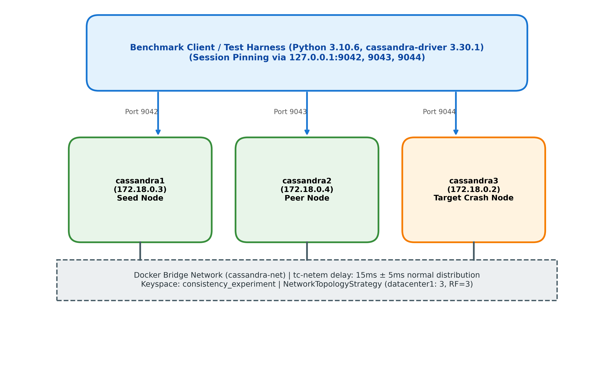
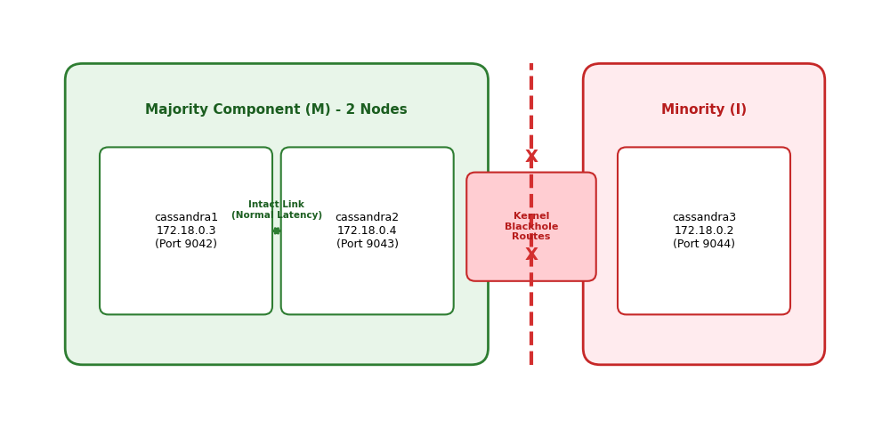
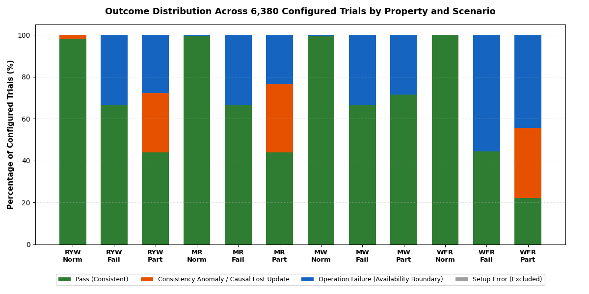
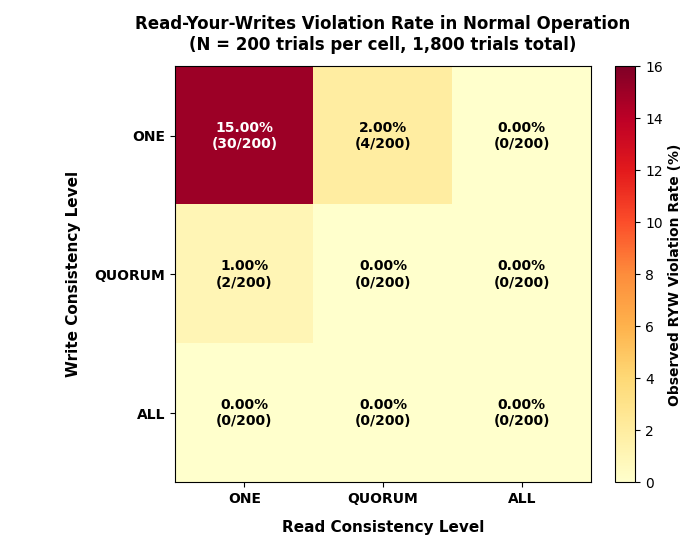
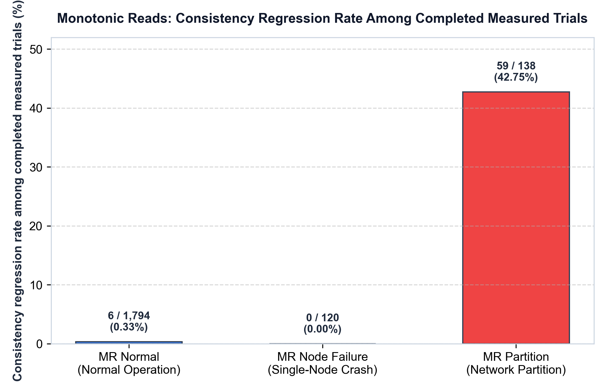
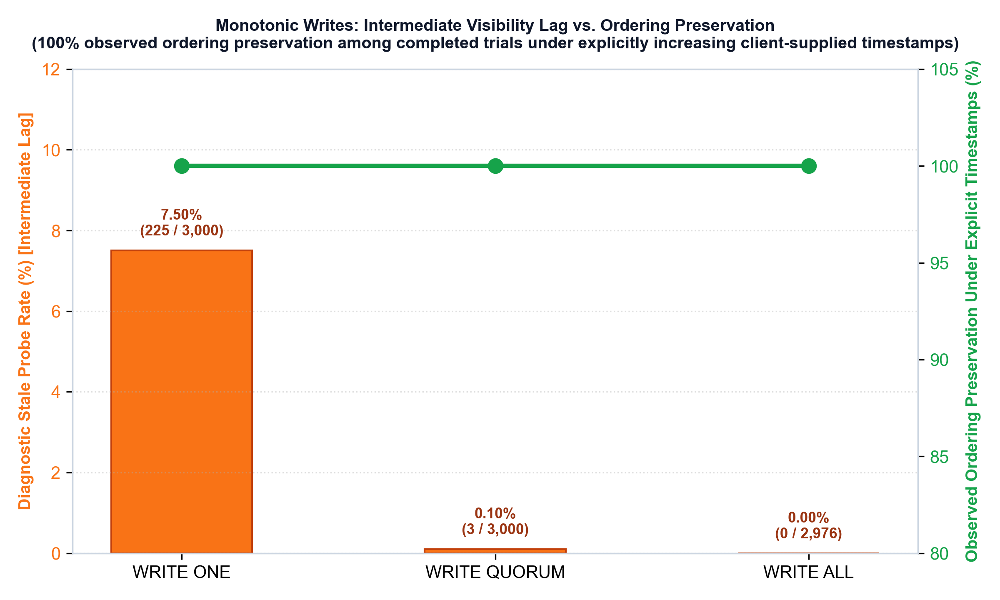
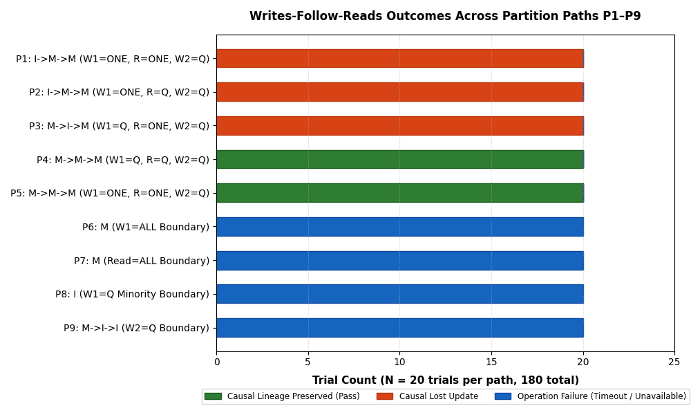

# Empirical Evaluation of Client-Centric Consistency Models in Apache Cassandra

This project empirically evaluates four fundamental client-centric consistency properties in **Apache Cassandra 4.1.12**:

* **Read-Your-Writes (RYW)**
* **Monotonic Reads (MR)**
* **Monotonic Writes (MW)**
* **Writes-Follow-Reads (WFR)**

The project evaluates these properties across three operational regimes:

1. **Normal operation**
2. **Single-node crash-stop failure**
3. **Symmetric network partition**

The experimental cluster is deployed locally using Docker with the following characteristics:
* Apache Cassandra 4.1.12
* 3 nodes (`cassandra1`, `cassandra2`, `cassandra3`)
* Replication Factor = 3 (RF=3)
* Single logical datacenter (`datacenter1`)
* Controlled WAN-like latency profile using Linux `tc-netem` (15 ms ± 5 ms normal distribution)

The `tc-netem` latency profile provides a controlled WAN-like latency baseline for the experiments and does not simulate a production wide-area network.

---

## Project Overview

In distributed storage systems, replication is essential for fault tolerance and high throughput. However, asynchronous propagation among replicas means that different nodes can observe updates at different times. Consequently, clients that interact with multiple coordinators may observe stale data, backward state regressions, or overwritten updates.

Apache Cassandra offers **tunable consistency**, enabling clients to select the read and write consistency level independently for each query. This design allows applications to trade immediate consistency for operational availability.

Client-centric consistency models define guarantees from the perspective of an individual client's session rather than assuming a single global clock. To examine the boundaries of these guarantees, this project introduces:
* **Single-node crash-stop failures:** Testing whether surviving replicas maintain consistency and availability when a replica disappears abruptly.
* **Symmetric network partitions:** Testing behavior when network isolation creates majority and minority components, evaluating stale reads, causal lost updates, and quorum rejection.

---

## Consistency Properties

| Property | What it checks |
| :--- | :--- |
| **Read-Your-Writes** | Whether a client can observe an older state after its own write |
| **Monotonic Reads** | Whether successive reads by a client can move backward to an older state |
| **Monotonic Writes** | Whether sequential writes preserve the intended ordering under the tested conditions |
| **Writes-Follow-Reads** | Whether a write based on a stale read can supersede an intervening write the client did not observe |

For Writes-Follow-Reads, the benchmark tests whether a client reading a stale value from an isolated partition issues a dependent write that subsequently overwrites an intervening write upon reconciliation. The benchmark observes client-visible states rather than an internal Cassandra causal-history graph.

---

## System Architecture

The deployment consists of three Cassandra container instances connected via a dedicated Docker bridge network (`cassandra-net`):

* `cassandra1` &mdash; Host port `9042` (Container IP: `172.28.0.2` / `172.18.0.3`)
* `cassandra2` &mdash; Host port `9043` (Container IP: `172.28.0.3` / `172.18.0.4`)
* `cassandra3` &mdash; Host port `9044` (Container IP: `172.28.0.4` / `172.18.0.2`)

Data is stored in keyspace `consistency_experiment` using `NetworkTopologyStrategy` configured with `datacenter1: 3`. With a replication factor of 3, every partition is replicated across all three cluster nodes.


*Figure 1: Deployment architecture and networking topology.*

---

## Software Environment

The experimental environment uses the versions documented below:

| Component | Version |
| :--- | :--- |
| Apache Cassandra | 4.1.12 |
| Docker | 27.2.0 |
| Host OS | Windows 11 Pro |
| Python | 3.10.6 |
| cassandra-driver | 3.30.1 |
| pandas | 2.1.4 |
| matplotlib | 3.8.2 |
| iproute2 | 5.10.0 |

---

## Consistency Levels

Experiments explore three core Cassandra consistency levels:

### `ONE`
Requires acknowledgment from one replica. The coordinator returns as soon as a single replica responds. Background digest comparisons are not performed during reads.

### `QUORUM`
For RF=3, requires acknowledgment from two replicas ($\lfloor N/2 \rfloor + 1 = 2$). The coordinator queries one data replica and one digest replica, initiating read repair if a digest mismatch is detected.

### `ALL`
Requires all three replicas to acknowledge the operation before the operation is considered successful.

### Quorum Overlap Condition
Strong consistency is expected when the write quorum $W$ and read quorum $R$ overlap:

$$W + R > \text{RF}$$

In our 3-node cluster ($\text{RF}=3$):
* $W=\text{QUORUM} (2) + R=\text{QUORUM} (2) = 4 > 3 \implies$ Quorums intersect on at least one replica.
* $W=\text{ALL} (3) + R=\text{ONE} (1) = 4 > 3 \implies$ Quorums intersect.
* $W=\text{ONE} (1) + R=\text{ONE} (1) = 2 \le 3 \implies$ Sub-quorum configuration with no guaranteed intersection.

---

## Network Conditions and Fault Injection

### Baseline Network Condition
Inter-node network delay is controlled inside each container using Linux traffic control (`tc-netem`):

```bash
tc qdisc add dev eth0 root netem delay 15ms 5ms distribution normal
```

This configuration provides a controlled WAN-like latency profile for the experiments.

### Node Failure
A crash-stop node failure is injected by abruptly stopping `cassandra3` (`docker stop cassandra3`). This evaluates operation availability and consistency degradation when only 2 of 3 replicas remain reachable.

### Network Partition
A symmetric network partition is created using Linux kernel blackhole routing (`ip route add blackhole`), completely severing bidirectional communication between `{cassandra1, cassandra2}` and `cassandra3`:

* **Majority component:** $M = \{\text{cassandra1}, \text{cassandra2}\}$ (2 nodes)
* **Minority component:** $I = \{\text{cassandra3}\}$ (1 node)


*Figure 2: Symmetric network partition topology isolating cassandra3 from cassandra1 and cassandra2.*

---

## Experimental Design

The test suite evaluates 12 operational scenarios configured as follows:

| Property | Normal | Node Failure | Network Partition |
| :--- | ---: | ---: | ---: |
| **RYW** | 1,800 | 180 | 180 |
| **MR** | 1,800 | 180 | 180 |
| **MW** | 600 | 60 | 140 |
| **WFR** | 900 | 180 | 180 |
| **Total** | **5,100** | **600** | **680** |

**Total: 6,380 configured trials**

* **Normal Experiments:** RYW, MR, and WFR evaluate all 9 ($3 \times 3$) combinations of write and read consistency levels. MW evaluates 3 write consistency levels with intermediate replica probing.
* **Fault Experiments:** Node-failure and network-partition suites test specific operational paths, generally allocating 20 trials per configuration or cross-partition path.

---

## Results

The table below presents the frozen benchmark results across all 12 experimental scenarios:

| Property | Scenario | Trials | Pass | Consistency Anomalies / Lost Updates | Operation Failures |
| :--- | :--- | ---: | ---: | ---: | ---: |
| **RYW** | Normal | 1,800 | 1,764 | 36 | 0 |
| **RYW** | Node Failure | 180 | 120 | 0 | 60 |
| **RYW** | Partition | 180 | 79 | 51 | 50 |
| **MR** | Normal | 1,800 | 1,788 | 6 | 3 |
| **MR** | Node Failure | 180 | 120 | 0 | 60 |
| **MR** | Partition | 180 | 79 | 59 | 42 |
| **MW** | Normal | 600 | 598 | 0 | 2 |
| **MW** | Node Failure | 60 | 40 | 0 | 20 |
| **MW** | Partition | 140 | 100 | 0 | 40 |
| **WFR** | Normal | 900 | 900 | 0 | 0 |
| **WFR** | Node Failure | 180 | 80 | 0 | 100 |
| **WFR** | Partition | 180 | 40 | 60 | 80 |

### Benchmark Totals
* **6,380** configured trials
* **5,708** passes
* **212** consistency anomalies / causal lost updates
* **457** operation failures
* **3** setup errors (isolated to MR normal baseline and excluded prior to measurement)

> **Note on Operation Failures:** Operation failures (such as `WriteTimeoutException` or `UnavailableException`) represent availability boundaries where Cassandra rejected the query due to insufficient reachable replicas. These are operational availability outcomes and are decoupled from consistency violations.


*Figure 3: Stacked outcome distribution across all 12 operational scenarios (6,380 configured trials).*

---

## Key Observations

### Read-Your-Writes (RYW)
* 36 violations occurred during normal operation.
* The observed normal-operation violations were concentrated in weak consistency-level combinations ($W=\text{ONE}, R=\text{ONE}$).
* 51 violations occurred during network partitioning when cross-component sub-quorum reads hit un-replicated replicas.
* No RYW violations were observed among completed node-failure trials.


*Figure 4: Read-Your-Writes violation rate heatmap across consistency level pairs (Normal Operation).*

### Monotonic Reads (MR)
* 6 regressions occurred among 1,794 completed measured normal-operation trials ($0.33\%$).
* 59 regressions occurred among 138 completed partition trials ($42.75\%$) when successive reads routed between isolated components.
* No regressions were observed among completed node-failure trials ($0 / 120$).


*Figure 5: Monotonic Reads consistency regression rate among completed measured trials across operational regimes.*

### Monotonic Writes (MW)
* 738 trials completed across all scenarios.
* No MW violation was observed.
* Across all completed trials, MW exhibited **100% observed ordering preservation among completed trials under explicitly increasing client-supplied timestamps**.
* This result is explicitly conditional on the experiment's increasing client-supplied timestamps ($T_1 < T_2$) and the tested Cassandra 4.1.12, 3-node, RF=3 environment. It does not establish behavior under arbitrary physical clock skew.
* Intermediate stale probes occurred during asynchronous replication (particularly with `WRITE ONE`), but these temporary lags were not classified as MW violations because the final write state was preserved.


*Figure 6: Monotonic Writes intermediate replica probe outcomes vs. ordering preservation (100% observed ordering preservation among completed trials under explicitly increasing client-supplied timestamps across 738 completed trials in Cassandra 4.1.12, N=3, RF=3).*

### Writes-Follow-Reads (WFR)
* Under symmetric partition, P1, P2, and P3 each produced 20/20 causal lost updates, accounting for all 60 observed WFR lost updates among the 100 completed partition trials.
* Under the tested partition paths, a client could read stale state from a disconnected component and issue a dependent update based on that stale state. After reconciliation, the dependent update superseded the previously unobserved write, resulting in a causal lost update.


*Figure 7: Writes-Follow-Reads path outcomes across majority ($M$) and isolated minority ($I$) partitions.*

---

## Repository Structure

```text
cassandra-docker/
├── read_your_writes/               # RYW experiment scripts, CSV results, and engineering notes
│   ├── experiments/                # normal.py, node_failure.py, network_partition.py
│   └── results/                    # Raw trial CSVs and summary CSVs
├── monotonic_reads/                # MR experiment scripts, CSV results, and engineering notes
│   ├── experiments/                # normal.py, node_failure.py, network_partition.py
│   └── results/                    # Raw trial CSVs and summary CSVs
├── monotonic_writes/               # MW experiment scripts, CSV results, and engineering notes
│   ├── experiments/                # normal.py, node_failure.py, network_partition.py
│   └── results/                    # Raw trial CSVs, probe CSVs, and summary CSVs
├── writes_follow_reads/            # WFR experiment scripts, CSV results, and engineering notes
│   ├── experiments/                # normal.py, node_failure.py, network_partition.py
│   └── results/                    # Raw trial CSVs and summary CSVs
├── report_figures/                 # Generated visualization assets (Figures 1-7)
├── docker-compose.yml              # 3-node Cassandra 4.1.12 cluster definition with NET_ADMIN capability
├── requirements.txt                # Python client dependencies (cassandra-driver, pandas, matplotlib)
├── setup_cluster.py                # Idempotent cluster bootstrap, schema setup, health check, and reset
├── client.py                       # Sample client connection script
└── README.md                       # Project documentation and reproduction guide
```

---

## Installation and Reproduction

### 1. Prerequisites and Environment Setup
Clone the repository and install the Python client requirements:

```bash
git clone https://github.com/AmitejSingh1/Cassandra-consistency-project.git
cd Cassandra-consistency-project
pip install -r requirements.txt
docker compose up -d
```

### 2. Cluster Bootstrap and Health Verification
Verify that all three nodes join the ring and reach status `UN` (Up/Normal):

```bash
# Check nodetool status on cassandra1
docker exec -it cassandra1 nodetool status

# Configure the 15ms ± 5ms controlled WAN-like latency profile inside each container
docker exec -it cassandra1 tc qdisc add dev eth0 root netem delay 15ms 5ms distribution normal
docker exec -it cassandra2 tc qdisc add dev eth0 root netem delay 15ms 5ms distribution normal
docker exec -it cassandra3 tc qdisc add dev eth0 root netem delay 15ms 5ms distribution normal

# Bootstrap the keyspace and consistency_test table
python setup_cluster.py

# Inspect cluster health and schema setup
python setup_cluster.py --status
```

### 3. Running Experiments

#### Normal Operation Experiments
```bash
python read_your_writes/experiments/normal.py
python monotonic_reads/experiments/normal.py
python monotonic_writes/experiments/normal.py
python writes_follow_reads/experiments/normal.py --trials 60
```

#### Node-Failure Experiments
```bash
python read_your_writes/experiments/node_failure.py --trials 20 --all-configs
python monotonic_reads/experiments/node_failure.py --trials 20
python monotonic_writes/experiments/node_failure.py --trials 20
python writes_follow_reads/experiments/node_failure.py --trials 20 --all-configs
```

#### Network-Partition Experiments
```bash
python read_your_writes/experiments/network_partition.py --trials 20 --all-paths
python monotonic_reads/experiments/network_partition.py --trials 20 --all-paths
python monotonic_writes/experiments/network_partition.py --trials 20
python writes_follow_reads/experiments/network_partition.py --trials 20 --all-paths
```

#### Cluster Cleanup and Recovery
If an experiment is interrupted or between fault runs:

```bash
# Ensure cassandra3 is running and remove any residual blackhole routes
docker start cassandra3
docker exec -it cassandra3 ip route del blackhole 172.18.0.3 2>/dev/null || true
docker exec -it cassandra3 ip route del blackhole 172.18.0.4 2>/dev/null || true

# Reset experimental table data
python setup_cluster.py --reset
```

The commands reproduce the experiment structure and workload. Individual trial outcomes may vary across executions because the experiments involve asynchronous distributed execution, randomized coordinator selection, and timing-dependent behavior; the reported numerical results correspond to the frozen benchmark run documented in this repository.

---

## Project Report

The final project report is currently being prepared and will be added to the repository after completion.

---

## Limitations

* **Cluster Topology:** Single-host, 3-node, single-datacenter deployment with Replication Factor = 3.
* **Controlled Network Latency:** While `tc-netem` introduces delay and jitter, it provides a controlled latency profile rather than replicating physical multi-datacenter WAN dynamics.
* **Sample Size:** Fault-injection scenarios evaluate a targeted sample size (typically 20 trials per path) due to the recovery overhead between fault cycles.
* **Client Timestamping:** Monotonic Writes experiments rely on explicitly increasing client-supplied timestamps; arbitrary physical clock skew across uncoordinated machines was not evaluated.
* **Consistency Scope:** Evaluates core CQL consistency levels (`ONE`, `QUORUM`, `ALL`); multi-datacenter levels (`LOCAL_QUORUM`, `EACH_QUORUM`) were outside the scope.
* **Empirical Nature:** All results reflect empirical measurements under the specific hardware, virtualization, and configuration parameters tested.

---

## Reproducibility Note

The reported numerical values correspond to the frozen benchmark run documented in this repository. Because distributed systems exhibit nondeterministic asynchronous scheduling, thread interleavings, and randomized coordinator selection, re-executing the benchmarks will produce similar behavioral trends but may yield varying individual trial outcomes.

---

## AI Usage

Generative AI tools, including Google DeepMind Antigravity, were used as development and documentation assistants during the project. AI assistance supported areas such as drafting benchmark scripts, debugging container networking, structuring result aggregation, formatting tables/figures, and refining documentation. Experimental results were generated from the project environment and recorded in the repository; AI assistance was not treated as experimental evidence.

---

## License / Academic Use

This repository was developed as a university project.
